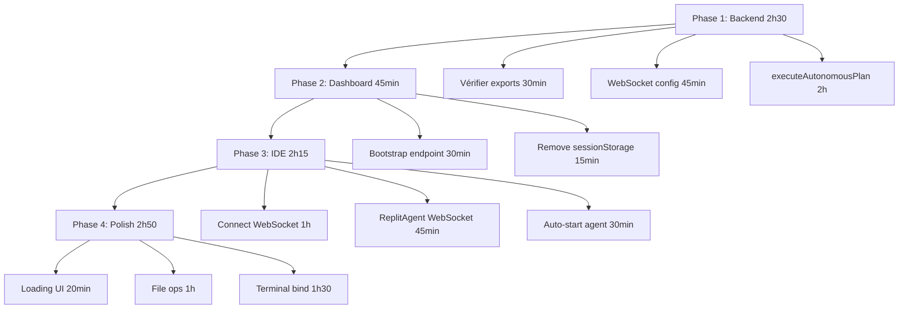

# 🎯 AI AGENT IDE - DASHBOARD PRODUCTION

**Date**: 2025-11-17 | **Status**: 🔴 En cours | **Progress**: 0/12 tâches critiques

---

## 📊 VUE D'ENSEMBLE

```
┌─────────────────────────────────────────────────────────────┐
│  ARCHITECTURE EXISTANTE (Fortune 500-Ready)                 │
│  ✅ 2003 lignes de code backend                             │
│  ✅ Workspace Bootstrap Endpoint                            │
│  ✅ Agent Orchestrator (1106 lignes)                        │
│  ✅ Workflow Engine (773 lignes)                            │
│  ✅ WebSocket Service (124 lignes)                          │
│  ✅ AI Plan Generator                                       │
│  ✅ File Operations + Command Execution                     │
└─────────────────────────────────────────────────────────────┘

┌─────────────────────────────────────────────────────────────┐
│  CE QUI MANQUE (Glue Code)                                  │
│  ❌ Dashboard → Bootstrap endpoint connection               │
│  ❌ IDE → WebSocket connection                              │
│  ❌ ReplitAgent → WebSocket integration                     │
│  ❌ Terminal → Command output binding                       │
│  ❌ executeAutonomousPlan implementation                    │
└─────────────────────────────────────────────────────────────┘
```

---

## 🔴 TÂCHES CRITIQUES (6 heures)

### Backend (2h 30min)

| # | Tâche | Fichier | Temps | Status |
|---|-------|---------|-------|--------|
| **8** | Vérifier exports services | `server/services/agent-*.service.ts` | 30 min | ❌ |
| **9** | WebSocket server config | `server/index.ts` | 45 min | ❌ |
| **10** | executeAutonomousPlan | `agent-orchestrator.service.ts` | 2h | ❌ |

### Frontend Dashboard (45 min)

| # | Tâche | Fichier | Temps | Status |
|---|-------|---------|-------|--------|
| **1** | Utiliser bootstrap endpoint | `Home.tsx`, `ProjectsPage.tsx` | 30 min | ❌ |
| **2** | Supprimer sessionStorage | `Home.tsx`, `Dashboard.tsx` | 15 min | ❌ |

### Frontend IDE (2h 15min)

| # | Tâche | Fichier | Temps | Status |
|---|-------|---------|-------|--------|
| **5** | Connecter WebSocket | `Editor.tsx` | 1h | ❌ |
| **6** | ReplitAgent WebSocket prop | `ReplitAgent.tsx` | 45 min | ❌ |
| **7** | Auto-démarrage agent | `ReplitAgent.tsx` | 30 min | ❌ |

---

## 🟡 TÂCHES IMPORTANTES (2h 50min)

| # | Tâche | Fichier | Temps | Status |
|---|-------|---------|-------|--------|
| **3** | Loading indicators | `Home.tsx`, `ProjectsPage.tsx` | 20 min | ❌ |
| **11** | File operations paths | `agent-file-operations.service.ts` | 1h | ❌ |
| **12** | Terminal binding | `agent-command-execution.service.ts` | 1h 30min | ❌ |

---

## ⏱️ TEMPS TOTAL

- **Critique** : 6h
- **Important** : 2h 50min
- **Nice to Have** : 3h 15min
- **TOTAL** : 12h

---

## 🚀 ORDRE D'EXÉCUTION



---

## ✅ FLUX CIBLE (Fortune 500)

```
USER
  │
  │ 1. Écrit "Create a todo app"
  ▼
DASHBOARD (Home.tsx)
  │
  │ 2. POST /api/workspace/bootstrap
  │    { prompt: "...", options: { autoStart: true } }
  ▼
BACKEND (workspace-bootstrap.router.ts)
  │
  ├─ 3. Create project in DB
  ├─ 4. Create agent session
  ├─ 5. Generate execution plan (AI)
  ├─ 6. Start autonomous execution (background)
  └─ 7. Return bootstrapToken (JWT)
  │
  │ 8. Redirect: /ide/123?bootstrap=TOKEN
  ▼
IDE (Editor.tsx)
  │
  ├─ 9. Parse bootstrapToken
  ├─ 10. Connect WebSocket: /ws/agent?projectId=X&sessionId=Y
  ├─ 11. Auto-open agent panel
  └─ 12. Pass WebSocket to ReplitAgent
  │
  ▼
REPLIT AGENT (ReplitAgent.tsx)
  │
  ├─ 13. Receive WebSocket messages
  ├─ 14. Display agent progress
  ├─ 15. Show files being created
  └─ 16. Show terminal output
  │
  ▼
BACKEND AUTONOMOUS EXECUTION
  │
  ├─ 17. Execute plan tasks sequentially
  ├─ 18. Create files (write_file)
  ├─ 19. Run commands (run_command)
  ├─ 20. Install packages (npm install)
  └─ 21. Broadcast progress via WebSocket
  │
  ▼
USER SEES REAL-TIME PROGRESS
  │
  ├─ Files appear in sidebar
  ├─ Terminal shows output
  ├─ Agent messages stream
  └─ Preview updates when ready
  │
  ▼
✅ PROJECT READY IN 1-2 MINUTES
```

---

## 🔍 DIAGNOSTIC RAPIDE

### Vérifier Backend

```bash
# 1. Services exports
grep -n "export.*planGenerator" server/services/agent-plan-generator.service.ts
grep -n "export.*agentWorkflowEngine" server/services/agent-workflow-engine.service.ts
grep -n "export.*agentWebSocketService" server/services/agent-websocket-service.ts

# 2. WebSocket setup
grep -n "WebSocketServer\|ws://" server/index.ts

# 3. executeAutonomousPlan
grep -n "executeAutonomousPlan" server/services/agent-orchestrator.service.ts
```

### Vérifier Frontend

```bash
# 1. Bootstrap endpoint usage
grep -n "/api/workspace/bootstrap" client/src/pages/Home.tsx

# 2. WebSocket connection
grep -n "new WebSocket" client/src/pages/Editor.tsx

# 3. ReplitAgent props
grep -n "websocket.*:" client/src/components/ReplitAgent.tsx
```

---

## 🎯 VALIDATION FINALE

Test complet à effectuer :

1. ✅ User écrit "Create a todo app with React"
2. ✅ Clique "Create with AI"
3. ✅ Voit loading (2-5s)
4. ✅ Redirigé vers IDE avec token
5. ✅ Agent panel s'ouvre auto
6. ✅ WebSocket connecté
7. ✅ Messages agent stream
8. ✅ Fichiers créés visibles
9. ✅ Terminal montre output
10. ✅ Preview se charge
11. ✅ App fonctionnelle en 1-2 min

---

## 📋 COMMANDES UTILES

### Développement

```bash
# Backend
npm run dev

# Frontend
npm run dev

# Tests
npm run test:ci
```

### Debug

```bash
# Backend logs
tail -f logs/application.log | grep -i "bootstrap\|orchestrator\|websocket"

# Frontend console
# Ouvrir DevTools → Console
# Chercher: [Workspace Bootstrap] [WebSocket] [ReplitAgent]
```

### Monitoring

```bash
# Health check
curl http://localhost:5000/health/detailed

# WebSocket test
wscat -c ws://localhost:5000/ws/agent?projectId=123&sessionId=abc
```

---

## 📞 SUPPORT

- **Documentation complète** : `AI-AGENT-IDE-PRODUCTION-CHECKLIST.md`
- **Fortune 500 Tools** : `FORTUNE-500-README.md`
- **Deployment** : `docs/REPLIT-DEPLOYMENT-GUIDE.md`

---

**Dernière mise à jour** : 2025-11-17 19:30
**Version** : 1.0
**Prochaine révision** : Après Phase 1 (backend)
