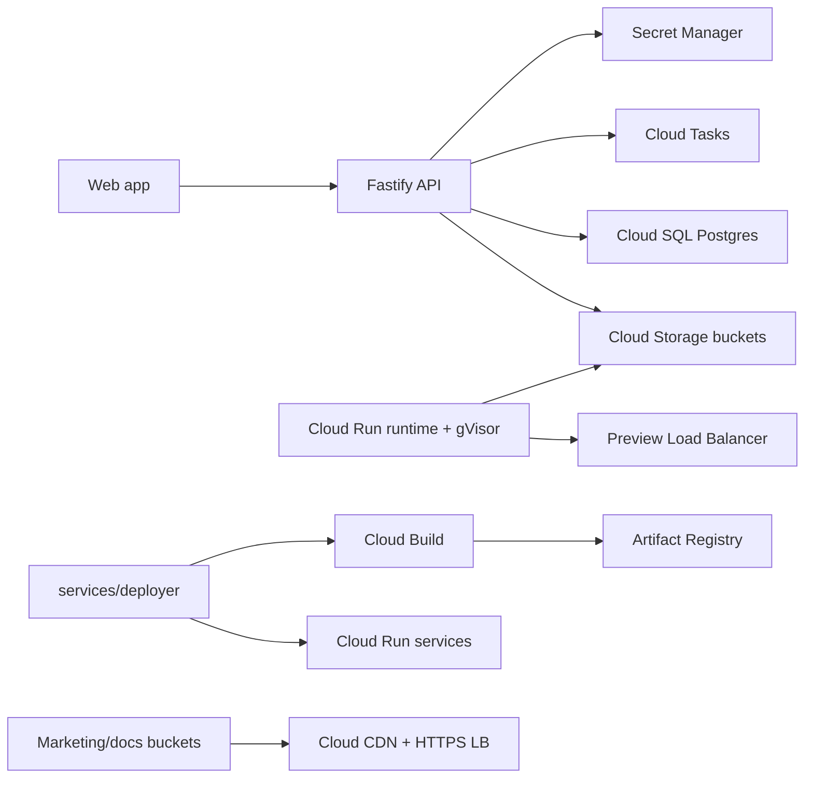
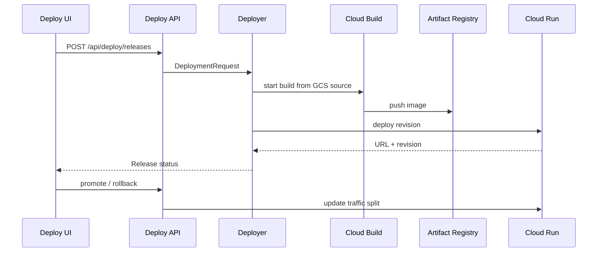
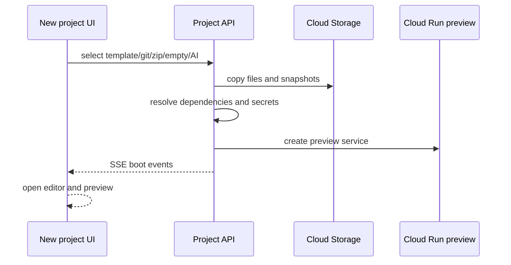

# Parallel Agent Report

Date: 2026-04-27

## Branches and Status

| Chantier | Branch | Commit | Status | Evidence |
| --- | --- | --- | --- | --- |
| 1 Design system + storage | `parallel/01-design-system` | `9104832a` | Partial | `packages/ui` and `packages/storage` typecheck/build pass; Storybook Cloud Run deployment needs infra wiring. |
| 2 Templates | `parallel/02-templates` | `5337de55` | Partial | 33 templates validate `/health`; catalog service test passes; real framework-depth templates and API project creation need backend integration. |
| 3 Create flow | `parallel/03-create-flow` | `73cc0c18` | Partial | Create-flow contract, targeted typecheck, lint, build, unit pass; active router/header wiring is outside ownership. |
| 4 AI generator | `parallel/04-ai-generator` | `c197c869` | Partial | AI generator contract, targeted typecheck, lint, build, unit pass; backend model orchestration endpoints are outside ownership. |
| 5 Deploy pipeline | `parallel/05-deploy` | `ae16c9db` | Partial | Deployer contract, deploy UI contract, service/UI typecheck, lint, build, unit pass; live GCP deploy not executed without project credentials and API wiring. |
| 6 Mobile shipping | `parallel/06-mobile-shipping` | `068bf600` | Partial | plist, entitlements, Android XML, store JSON, mobile shipping contract, lint, build, unit pass; signed app builds and screenshots require active native project integration. |
| 7 Marketing/docs/CDN | `parallel/07-marketing-docs` | `HEAD` | Partial | Marketing/docs build and contract tests pass; Terraform CLI unavailable locally; community gallery route/API are outside ownership. |

## Cloud URLs

No public Cloud Run, Cloud CDN, Storybook, marketing, docs, gallery, or template example URLs were deployed from this workspace because the task constraints require Terraform or reproducible scripts and the local environment does not provide a configured GCP project, Cloud Build trigger, DNS authority, signing assets, or `terraform` binary.

## Metrics

- `packages/ui` Button standalone gzip: 1304 bytes during chantier 1 validation.
- Templates validated: 33/33 local `/health` boot checks.
- Root gates repeatedly passed on touched branches: `npm run lint`, `pnpm build`, `npm run test:unit`.
- Marketing build: 7 static pages.
- Docs build: 7 static pages plus generated `search-index.json`.
- GCP monthly cost estimate requires selected regions, request volume, Cloud Run min instances, Artifact Registry storage, Cloud CDN egress and Cloud Logging retention. The Terraform modules expose the deployable primitives but no production traffic profile exists locally.

## Known Limits

- The active app shell lives under `client/src/**`; most new `apps/web/src/**` modules need router/header/command registration by the frontend owner.
- Backend/agent endpoints are outside this agent's ownership and are listed in `COORDINATION_NEEDED.md`.
- Store screenshots and preview videos were not fabricated; they must be captured from signed native builds.
- Terraform validation could not run locally because `terraform` is not installed.
- No claim of production-ready certification is made for these branches; they are bounded, validated contributions inside the assigned file zones.

## GCP Architecture

## Deployment Flow

## Creation Flow

